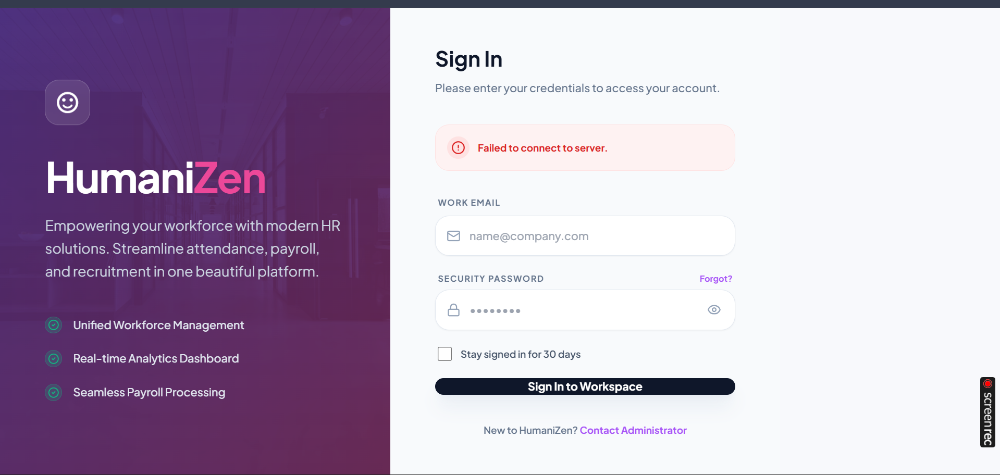
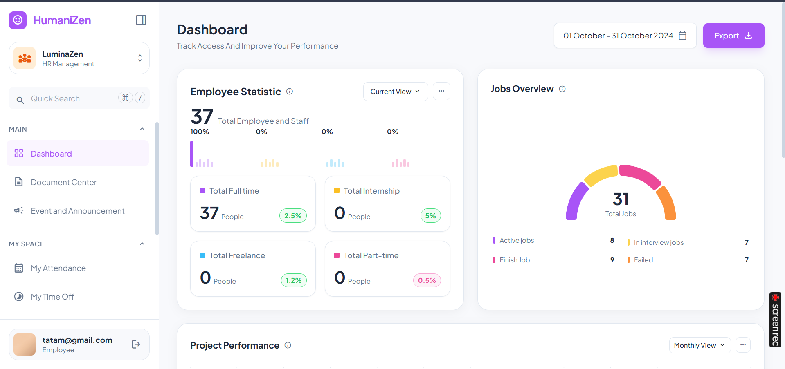
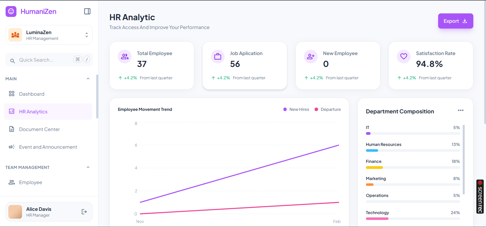
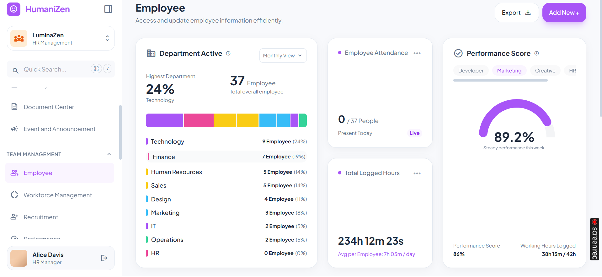
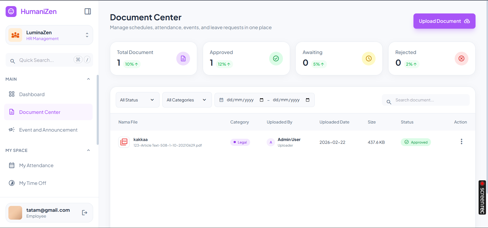
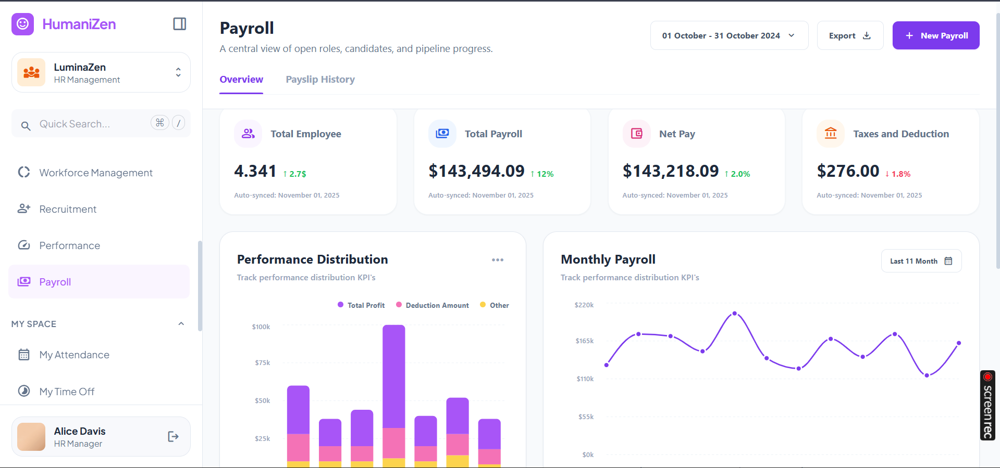

# HumaniZen HR Dashboard

Welcome to the HumaniZen HR Dashboard! This application is designed to streamline HR processes and provide a seamless experience for managing employees, payroll, attendance, and more. The application is accessible online at [hr.resikplus.id](http://hr.resikplus.id).

---

## Features

### Backend Features
The backend is implemented using Django and Django Rest Framework. Below are the key features:

1. **Project Structure & Core**
   - **Monorepo Setup**: Configured within `apps/backend/`.
   - **Modular Apps**: Separate Django apps for each domain:
     - `core`: Department, Employee
     - `accounts`: Custom User, Authentication
     - `recruitment`: Jobs, Candidates, Interviews
     - `attendance`: Records, Segments
     - `leave`: Requests, Balances
     - `payroll`: Records, Payslips
     - `performance`: Reviews
     - `documents`: File Management
     - `events`: Company Events
     - `schedules`: Shift Management
     - `analytics`: Dashboard Metrics

2. **Authentication & Authorization**
   - JWT Authentication using `simplejwt`.
   - Custom User Model with email as the unique identifier.
   - Role-Based Access Control (Admin, HR, Manager, Employee).

3. **API Endpoints**
   - Comprehensive REST APIs for all modules. Key endpoints include:
     - Core: `/api/employees/`, `/api/departments/`
     - Recruitment: `/api/jobs/`, `/api/candidates/`
     - Attendance: `/api/attendance/` (includes custom actions `clock_in`, `clock_out`)
     - Leave: `/api/leaves/`
     - Payroll: `/api/payroll/` (includes `my-latest-payslip`)
     - Performance: `/api/performance/`
     - Dashboard: `/api/dashboard/summary/`

4. **Admin Interface**
   - Fully robust Django Admin panel for managing all models.

### Frontend Features
The frontend is built using modern JavaScript frameworks and tools. Below are the highlights:

- **Responsive Design**: Optimized for both desktop and mobile devices.
- **Interactive Dashboard**: Provides key HR metrics and analytics.
- **Employee Management**: Manage employee details, roles, and departments.
- **Attendance Tracking**: Clock-in/clock-out functionality.
- **Payroll Management**: Generate and view payslips.
- **Leave Requests**: Submit and approve leave requests.

---

## Screenshots
Below are some screenshots of the application:

### Login Page


### Dashboard


### HR Analytics Dashboard


### Employee Management


### Document Center


### Payroll Dashboard


---

## How to Access
The application is hosted online and can be accessed at:
[http://hr.resikplus.id](http://hr.resikplus.id)

---

## Getting Started

### Prerequisites
- Node.js and npm (for frontend development)
- Python 3.8+ and pip (for backend development)
- Django and Django Rest Framework

### Installation
1. Clone the repository:
   ```bash
   git clone https://github.com/your-repo/hr-dashboard.git
   ```
2. Navigate to the backend directory and install dependencies:
   ```bash
   cd apps/backend
   pip install -r requirements.txt
   ```
3. Navigate to the frontend directory and install dependencies:
   ```bash
   cd dashboard
   npm install
   ```

4. Run the backend server:
   ```bash
   python manage.py runserver
   ```

5. Run the frontend development server:
   ```bash
   npm run dev
   ```

---

## License
This project is licensed under the MIT License. See the LICENSE file for details.

---

## Contributors
- [Your Name](mailto:your.email@example.com)
- [Contributor Name](mailto:contributor.email@example.com)
